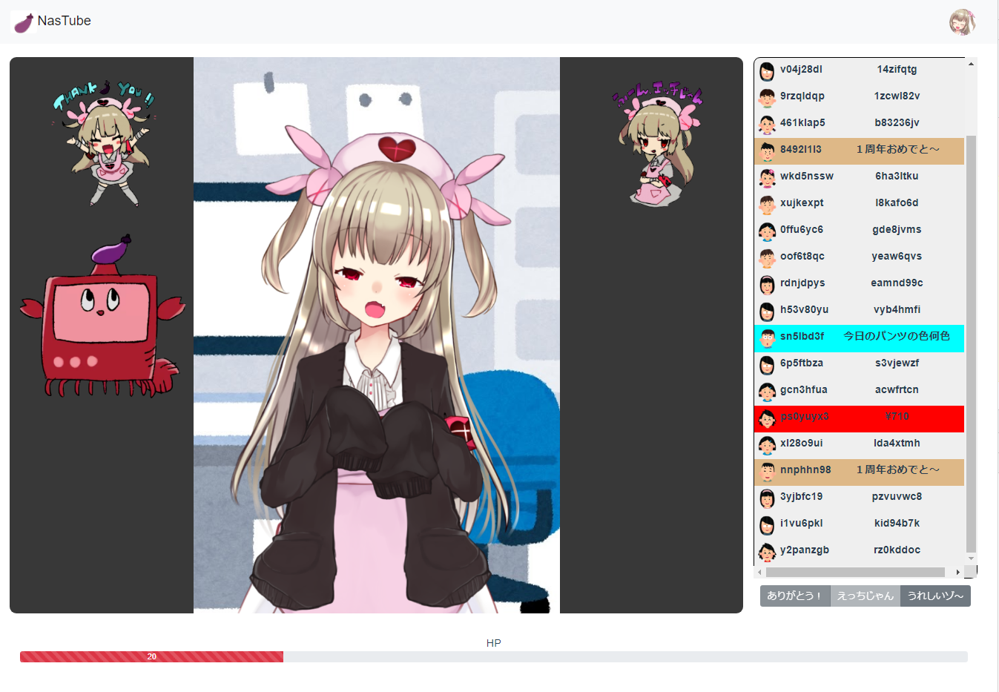

# 名取が作った超有名配信プラットフォームIRINASを題材にしたゲーム

## 起動方法
```
git clone https://github.com/naporin0624/irinasgame.git
npn install
node server.js
```
dist/配下にアプリケーションのファイルが生成されるのでそれだけを使えば大丈夫です。
最新版は
```
npm run dev
```
で動作しますが、あくまで最新版なのでいろいろやばいかもです。
```
npm run build
node server.js
```
でも構いません
## ゲーム画面


## 遊び方
流れるコメントに反応しよう！！コメントに反応するたびに来場者数が増えていくぞ！

コメント欄の下にあるボタンが点滅するからそのタイミングで押そう！

できるだけ多くの来場者に来てもらえるように頑張ろう！

## なんて書いからいいかわからない欄
- 今回イラストを貸してくださった方はこちら
	- [寝落ち🍆さん](https://twitter.com/zuho_cpp)
- 名取を起きたい部分にフリーイラスト使用しました
	 - お貸ししてくださる方がいれば[napolitain🍆](https://twitter.com/naporin24690)までお願いいたします
- このゲームは[名取さな](https://twitter.com/sana_natori)様とは関係ありません。
	- 勝手に作ってごめんなさい
	- いつも配信、ツツイ楽しませてもらっています！